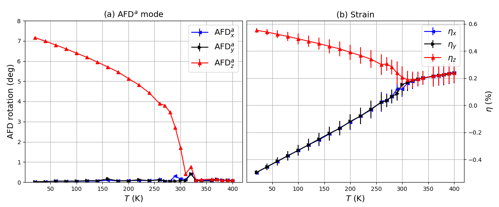

# ezSCUP: SCALE-UP made easy.

ezSCUP is a Python module designed to facilitate the execution of SCALE-UP simulations in a parameter grid of temperatures, pressures, strains and/or electric fields, providing a high-level interface to handle the program and its output. It includes several analysis functions regarding structural modes and polarization in perovskites. 

SCALE-UP (short for **S**econd-principles **C**omputational **A**pproach for **L**attice and **E**lectrons) is a Second-Principles DFT simulation program written in Fortran and developed by researchers from the University of Catabria (UC, Spain) and the Luxembourg Institute of Science and Technology (LIST), as well as by a number of collaborators [[+info]](https://www.secondprinciples.unican.es/).  

This module has been developed as an integral part of my Bachelor's final-year thesis on structural transititions within the perovskite SrTiO3. 

## Features

- Schedule simulations in a grid of temperatures, strains, pressures and electric fields.
- Produce en equilibrium geometry for each configuration, and access all its output data through Python.
- Project structural modes onto said equilibrium geometry, such as the ferroelectric (FE) 
or antiferrodistortive (AFD) modes in perovskites.
- Obtain the emergent polarization from the collective atomic displacements via the use of Born effective charges.
- Observe (in large enough simulation supercells) domain structures through a per-unit-cell application of the two previous features.

## Usage

There are some examples within this repository corresponding to several use cases explored in my thesis. In particular, the STRAIN-FREE setup attempts to simulate the AFD phase transition present in SrTiO3 at 105K, whereas within STRAIN-FIXED it can be observed how SrTiO3 responds to epitaxial strain restrictions. The SrTiO3 model contained in these examples corresponds to the one used by Wojdeł et al. in [here](https://iopscience.iop.org/article/10.1088/0953-8984/25/30/305401).

 

 
Representation of the antiferrodistortive phase transition present in bulk SrTiO3 simulated with ezSCUP.

